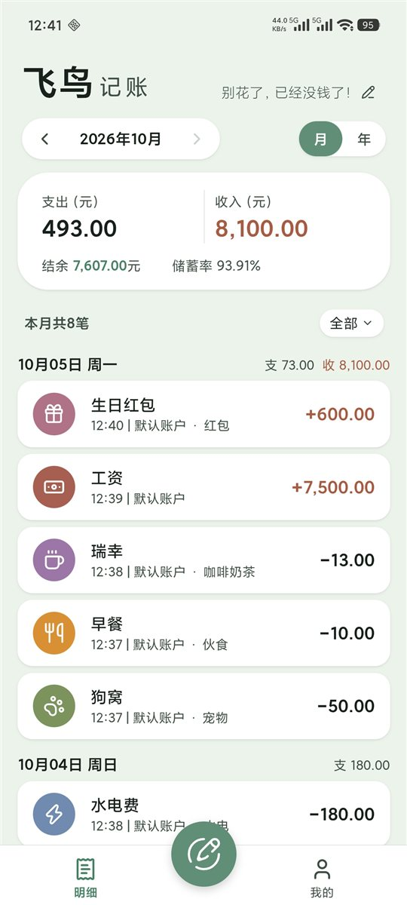
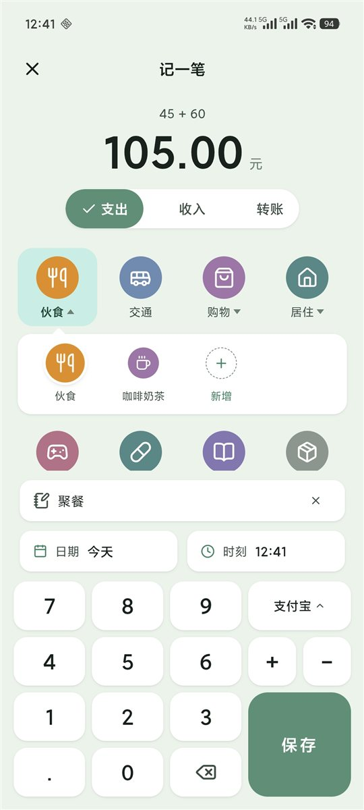
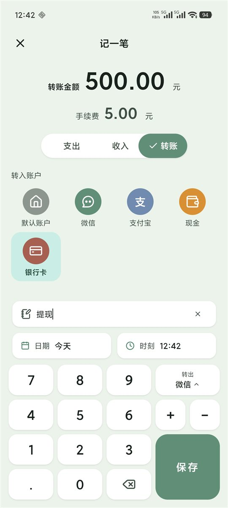
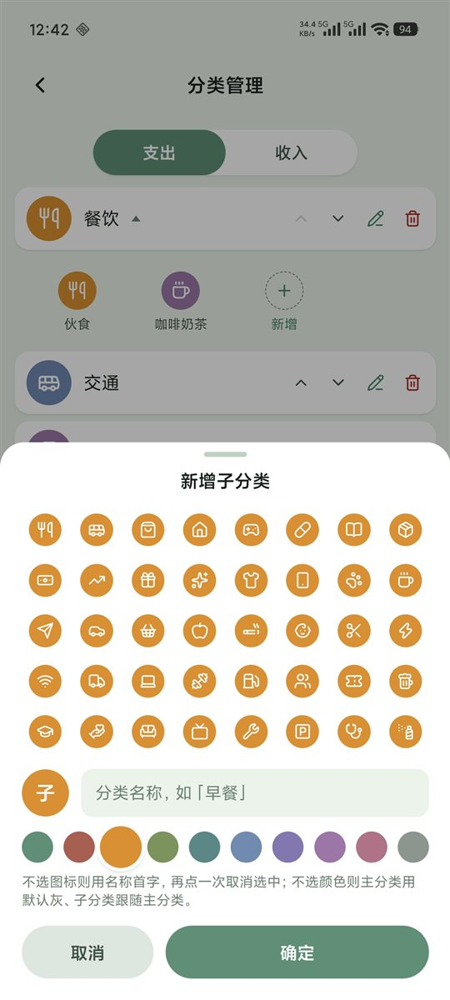
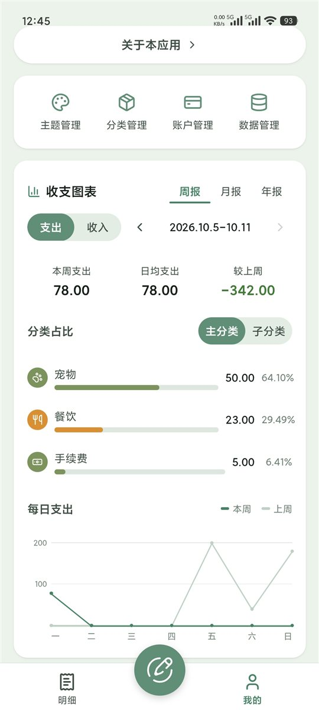
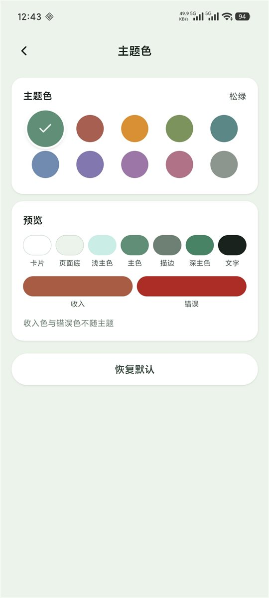
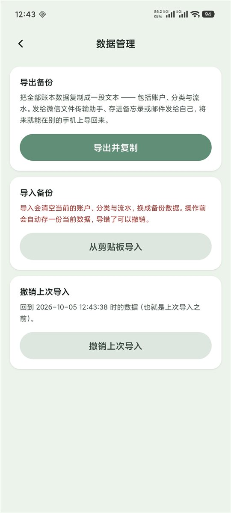

# 飞鸟记账 · FeatherLedger

本地记账 App：明细、分类、账户、统计与主题。**数据只存在本机，不联网、不上传。**

基于 uni-app（Vue 3 / Options API）开发，**零 npm 依赖** —— 不需要 `npm install`，
仓库里没有任何第三方运行时库，界面与逻辑全部是仓库内的代码。数据库走 App 端原生的
`plus.sqlite`（SQLite），因此只支持 **App 端（Android / iOS）**，不支持 H5 与小程序。

## 界面

| | | |
| --- | --- | --- |
| **首页 · 明细**<br> | **记一笔 · 金额加减**<br> | **转账（含手续费）**<br> |
| **分类 · 图标与色板**<br> | **统计 · 占比与趋势**<br> | **主题 · 10 套预设**<br> |
| **数据 · 导出 / 导入 / 撤销**<br> | | |

## 功能

| 模块 | 说明 |
| --- | --- |
| 记一笔 | 支出 / 收入 / 转账（含手续费）；自绘数字键盘，金额可以连着加减（`+` / `−` 把当前这笔折进算式，金额栏实时算，算式以小字显示在金额上方）；日期与时刻各是一组自绘滚轮 |
| 常用备注 | 备注框敲「水」，下面自己摆出「水电费」这类记过的备注，点一下填进去。当前分类下记过的优先（父分类算同一类），其次看记过多少次、最近什么时候用过 |
| 首页 | 按月 / 按年查看，明细按日分组并显示所属账户；可切换账户 |
| 分类 | 主分类 + 子分类，支出 40 款 / 收入 16 款内置图标、10 色调色板 |
| 账户 | 余额、初始余额、收发汇总 |
| 预付 | 垫付 / 报销：垫出去的钱从原支出账户挪进「预付账户」（记成转账，**不影响当月收支**），收回、结清各按需补记流水；首页流水带「预付」「结清」标记，结清后移入「预付历史」（可长按取消结清） |
| 统计 | 分类占比与趋势；点占比里的任何一个分类，可下钻到它的明细 |
| 分类明细 | 这一个分类在这一期里的流水，按日（年报按月）分组；可按账户筛，长按一行进编辑 / 删除 |
| 主题 | 10 套预设配色 + 个性签名 |
| 数据 | 导出 / 导入 / 撤销上次导入（整份 JSON） |
| 关于 | 隐私政策、第三方许可全文 |

## 运行

1. 用 [HBuilderX](https://www.dcloud.io/hbuilderx.html) 打开本目录（文件 → 导入 → 从本地目录导入）。
2. 运行 → 运行到手机或模拟器（Android 需打开 USB 调试）。
3. 打包：发行 → 原生 App-云打包。

不需要 npm，也没有构建配置要改。

## 目录

```
pages/          页面：首页 / 记一笔 / 分类 / 账户 / 主题 / 数据 / 我的 / 关于
components/     自绘组件：tabBar、分类图标、确认卡片、统计面板、图标飞行动画
services/       逻辑层：account 账户、record 流水、category 分类、stats 统计、
                backup 备份、theme + palette 主题色板、icons 图标注册表、
                db 数据库、format 格式化、meta 杂项键值、press 按压反馈、tab-swipe 滑动
static/         静态资源
screenshots/    README 用的界面截图
App.vue         全局样式（设计令牌、卡片、弹层三件套）
main.js         入口 + 全局 mixin（主题变量、输入框的 cursor-spacing）
pages.json      路由与 tabBar
manifest.json   应用配置
uni.scss        全局 Less 变量
```

## 架构约定

- 三层：`pages`（界面） → `services`（业务） → `db.js`（只碰 SQLite，模块单例）。
- **金额一律以「分」存整数**，只在显示层换算成元；日期 `YYYY-MM-DD`、时刻 `HH:MM`（24 小时制）。
- 余额不落库，按流水 `SUM` 现算。
- 数据库迁移逐条打标记、可重复执行；加列后紧跟一句把已有行补成默认值。
- 样式只用 Less + `rpx`，颜色全部走 CSS 变量（切主题时整页跟着变）。

## 许可

代码以 [MIT](LICENSE) 许可发布。

界面与代码**由 AI 生成** —— 需求、取舍与真机验收由作者完成，界面与代码由 AI 产出。

仓库用到的第三方图标：[Lucide](https://lucide.dev)（ISC）、
[Solar](https://solar-icons.vercel.app)（CC BY 4.0）。
完整许可全文见 [`THIRD-PARTY-NOTICES.md`](THIRD-PARTY-NOTICES.md)，App 内也有一份
（关于 → 第三方声明 → 查看许可全文）。

作者：飞鸟Tokei
